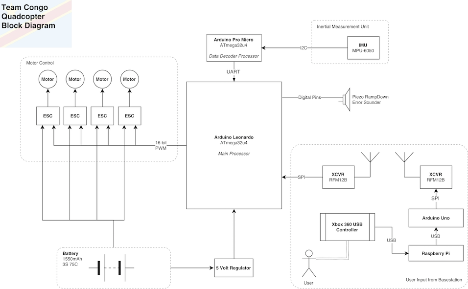
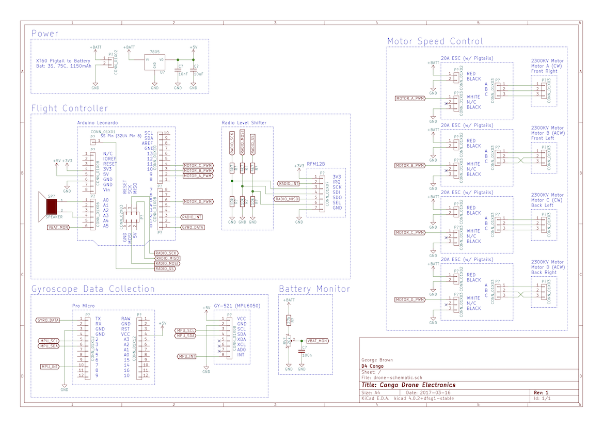
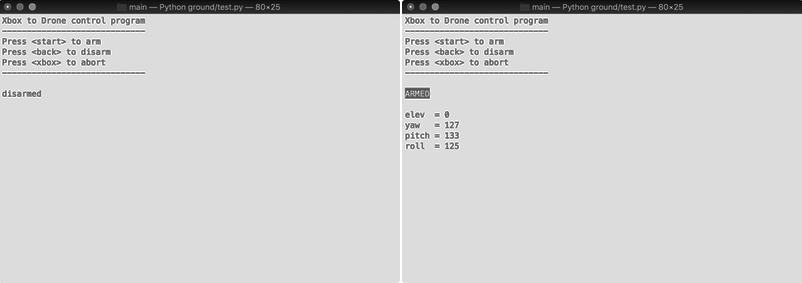

# D4 Design Exercise: ITCHEN

This design exercise was run during the second year of university. We were
tasked to design and build a UAV capable of stable flight and delivering a
payload in just two weeks. This is a git repository of the final product that
was submitted.

#### Team Congo
* [George Brown](https://www.github.com/GeorgeBrown128) (Team Leader)
* [Rhys Thomas](https://www.github.com/rhthomas) (Communications)
* [Tom Darlison](https://www.github.com/tomdarl) (Motor Control, Pilot)
* [Adam Melvin](https://www.github.com/theinsanetramp) (Simulations, PID Tuning)
* [Felix de Neve](https://www.github.com/FelixChrist) (Remote Decoding)

Our drone was able to fly continuously for 10 minutes and lift a maximum payload
of 1kg. This exercise was a competition between ourselves and 9 other groups, of
which we placed **1st**!

The documentation for the final product can be found at
[https://rhthomas.github.io/docs/itchen](https://rhthomas.github.io/docs/itchen).

The brain of the drone was an Arduino Leonardo. This processed the PID control
loop computations, and adjusted the speed of the motors accordingly in order to
keep the drone stable. Sensor data was read from an IMU on a separate Arduino
Pro Micro and sent to the Leonardo over UART.

The drone was controlled with an Xbox 360 controller, the joystick data of which
was decoded by a Raspberry Pi, then sent to an Arduino to transmit the
set-points to the drone.

